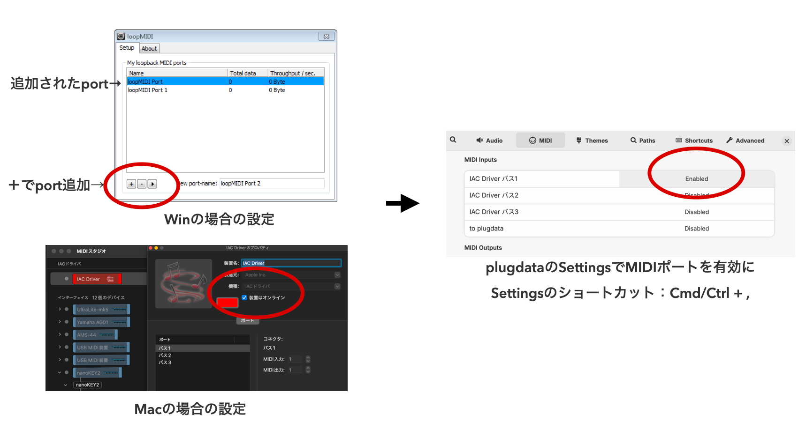
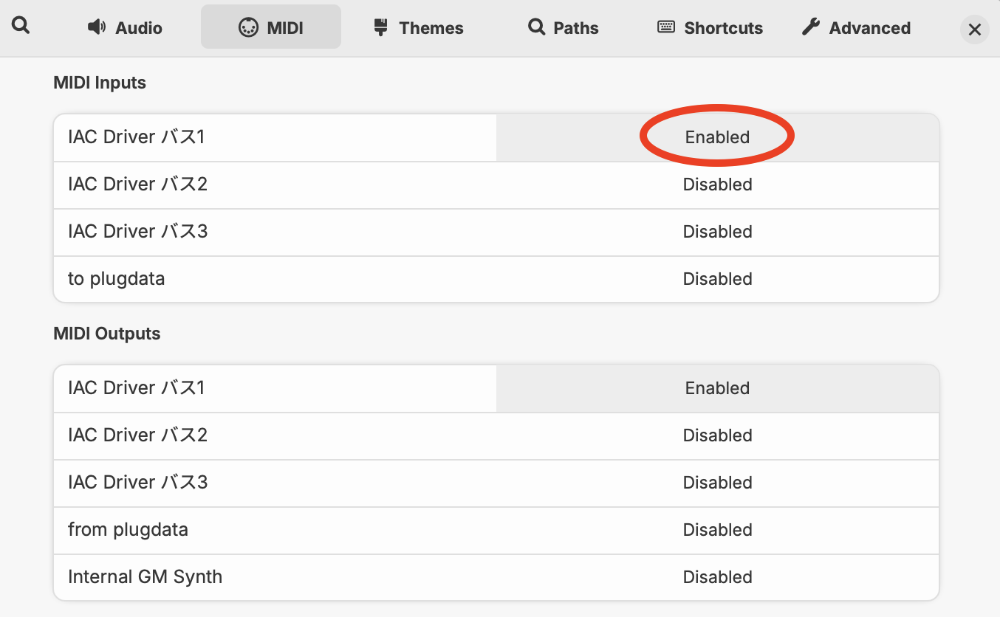
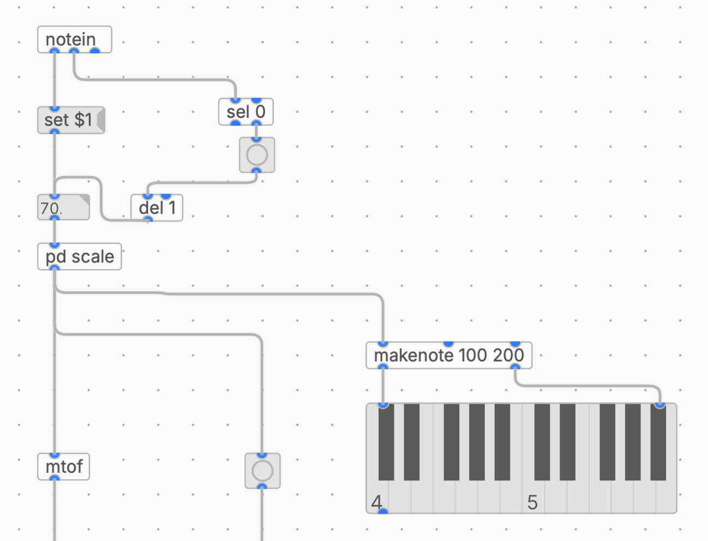

## 第8回 外部との連携① ― Web MIDI

**滋賀大学 自主ゼミ「サウンドプログラミング入門」 2026年度 春学期**

[サンプルパッチ① 2.4節 MIDIを受け取るシンセ](https://raw.githubusercontent.com/takanoma1990/plugdata_study/refs/heads/main/lectures/8_webmidi/patch/1_get_midi_synth.pd)

[サンプルパッチ② 2.6節 リバーブを足したシンセ](https://raw.githubusercontent.com/takanoma1990/plugdata_study/refs/heads/main/lectures/8_webmidi/patch/2_get_midi_synth_reverb.pd)

[サンプルコード① 2.5節 p5.js（マウスで演奏）](https://editor.p5js.org/takano_ma/sketches/QOlqAvnRB)

[サンプルコード② 2.6節 p5.js（自動演奏）](https://editor.p5js.org/takano_ma/sketches/dv8SJxjbo)

## 今回の目的

### 今回扱うこと

第7回では [mouse] を使って、マウスの位置で音を操作しました。今回と次回は、**plugdata の外側にあるプログラムから音を鳴らす** 方法を扱います。音を作るのは plugdata に任せたまま、「いつ・どんな値で鳴らすか」を別の環境が決める、という分業の形です。

今回はブラウザから MIDI を送ります。

1. **MIDI と OSC** ― 2つの経路の違い
2. **Web MIDI API と仮想MIDIポート** ― ブラウザと plugdata を繋ぐ
3. **plugdata で MIDI を受ける** ― [notein] と [ctlin]
4. **マウスクリックで音を鳴らす**
5. **自動演奏に差し替える**


## 1. MIDI と OSC

外部から plugdata へ値を送る経路としてはMIDIかOSCの二つの選択肢があります。

| | MIDI | OSC |
|---|---|---|
| データの形 | ノート番号・ベロシティなど、決められた種類 | `/x` `/hand/open` のように、自分で決めたアドレスと値 |
| 値の範囲 | 0〜127（7ビット）の整数が基本 | 浮動小数点・整数・文字列など任意 |
| 経路 | MIDIポート（今回は仮想MIDIポート） | ネットワーク（UDP）、ポート番号で指定 |
| plugdata側の受け口 | [notein]、[ctlin] | [netreceive] + [oscparse] |

**音符として扱えるもの（音を鳴らす・止める）は MIDI**、**センサの値のような連続量や、独自に名前をつけたいデータは OSC** が向いています。MIDI は分解能が128段階しかない代わりに、DAWやシンセなど既存の機材とそのまま繋がるという強みがあります。


## 2. p5.js から MIDI を送る

### 2.1 Web MIDI API

**Web MIDI API** は、ブラウザから MIDI 機器を扱うためのAPIです。`navigator.requestMIDIAccess()` を呼ぶと、PCに繋がっている MIDI の入出力ポートの一覧が取得できます。ブラウザによっては使えなかったりするので、今回は安定して利用できるChromeを使っていきます。（VSCodeを利用している場合は、Live Serverというライブラリを使って利用も可能です）

### 2.2 仮想MIDIポートを用意する（loopMIDI）

ブラウザと plugdata は別々のアプリケーションなので、その間を繋ぐ **仮想MIDIポート**が必要になります。Windows には標準の仮想MIDIポートがないため、**loopMIDI**（無償）を使って用意します。

| 手順 | 内容 |
|---|---|
| ① ダウンロード | https://www.tobias-erichsen.de/software/loopmidi.html からインストーラを取得 |
| ② インストール | ダウンロードしたファイルを実行する |
| ③ 起動 | loopMIDI を起動する。ウィンドウに空のポート一覧が表示される |
| ④ ポートを作る | 下部の「New port-name」に名前（例：`plugdata`）を入力し、左下の「+」ボタンを押す |
| ⑤ 確認 | 一覧に作ったポートが追加されていればOK |

作ったポートは、loopMIDI を起動している間だけ有効です。

macOS の場合は標準機能で用意できます。「Audio MIDI設定」→ メニューの「ウインドウ」→「MIDIスタジオを表示」→「IACドライバ」をダブルクリック →「装置がオンライン」にチェック、で `IAC Driver Bus 1` が使えるようになります。



### 2.3 plugdata 側の設定

plugdata の Settings を開き、**MIDI** の項目で、いま作ったポートを **MIDI入力** として有効にします。第1回で設定したオーディオの入出力と同じ画面です。



### 2.4 MIDI を受け取る（[notein]）

受け取りには **[notein]** を使います。3つのアウトレットから、それぞれ次の値が出てきます。

| アウトレット | 出てくる値 |
|---|---|
| 左 | ノート番号（0〜127、60が中央のド） |
| 中央 | ベロシティ（0〜127、0はノートオフ） |
| 右 | MIDIチャンネル（1〜16） |

ノート番号は [pd scale] に通してスケールに合った音程にそろえてから、[mtof] で周波数に変換します。[pd scale] は第3回で作ったものをそのまま使えます。

ここで問題が2つあります。

1つは、[notein] が **ノートオンのときとノートオフのときの2回** 値を出すことです。ノート番号をそのまま繋ぐと、1回のクリックで音が2回鳴ってしまいます。そこで少し回りくどいですが、ノート番号を一度 **数値ボックスに保存しておき**、ノートオンのときだけ bang で取り出す形にします。

もう1つは、値が出てくる順番です。[notein] は第一アウトレットがノートナンバー、第二アウトレットがベロシティですが、オブジェクトは右側のアウトレットから順番に値を出力します。つまりベロシティのほうが先に届くため、そのままでは1つ前のノート番号を取り出してしまいます。[sel 0] から出るトリガーに [del 1] を挟んで1msずらし、ノート番号が保存されたあとに取り出すようにします。

| オブジェクト | 役割 |
|---|---|
| [set $1( | 受け取ったノート番号を数値ボックスに **書き込むだけ**（出力はしない） |
| [sel 0] | ベロシティが0かどうかを判定する。右のアウトレットからは **0以外の値**、つまりノートオンのときだけ値が出る |
| [bng] | [sel 0] から出てきた値を bang に変換する |
| [del 1] | ノート番号が保存されたあとにトリガーが出るよう、1msずらす |

数値ボックスは bang を受け取ると、保存している値を出力します。これでノートオンのときだけノート番号が1回だけ流れ、[envgen~] のトリガーも1回だけになります。

```
[notein]
|              \
[set $1(       [sel 0]
|                   |（右：0以外のとき）
[88. ]<--[del 1]---[bng]
|
[pd scale]
|
[mtof]
```

[pd scale] の出力は [makenote 100 200] を経由して [keyboard] にも送っています。いまどの音が鳴っているかを鍵盤の表示で確認できます。

コントロールチェンジは [ctlin] で受け取ります。サンプルパッチ①では [ctlin 1] を [scale 0 127 -1 1] で変換し、[pan2~] に繋いでいます。



### 2.5 マウスクリックで音を鳴らす（[サンプルコード](https://editor.p5js.org/takano_ma/sketches/QOlqAvnRB))

次にp5.jsでWeb MIDIを送信するプログラムを準備します。

Web MIDI では、MIDIメッセージを **3つの数値の配列** として送ります。

| 内容 | ステータスバイト | データ1 | データ2 |
|---|---|---|---|
| ノートオン | 0x90 | ノート番号 | ベロシティ |
| ノートオフ | 0x80 | ノート番号 | 0 |
| コントロールチェンジ | 0xB0 | CC番号 | 値（0〜127） |

`send()` の第2引数に時刻を渡すと、その時刻に送られるように予約できます。これを使うと「鳴らして、少し後に止める」が素直に書けます。ただし今回はplugdataで `[envgen~]` を使うので、ノート音の部分だけをトリガーとして利用します。**実際にはDAWで利用するMIDIインストゥルメントを演奏する際にはノートオフが利用できます。**

```
midiOut.send([0x90, note, velocity]);                        // すぐ鳴らす
midiOut.send([0x80, note, 0], performance.now() + 400);      // 400ms後に止める
```

サンプルコードでは、キャンバスをクリックすると音が鳴ります。マッピングは次の通りです。

| 操作 | 送るもの | plugdata側 |
|---|---|---|
| クリック位置のY座標 | ノート番号 50〜90（上ほど高い） | 音の高さ |
| クリック位置のX座標 | CC No.1 | 音の左右位置（パン） |
| ベロシティ | 60〜90 のランダム | 音の強さ |

```
let note = floor(map(mouseY, height, 0, 50, 90, true));
let velocity = floor(random(60, 90));
let pan = floor(map(mouseX, 0, width, 0, 127, true));

sendCC(1, pan);
sendNote(note, velocity, 400);
```

ノート番号は50〜90をそのまま送っているので、このままでは半音刻みになります。今回は作成済みのサブパッチ  [pd scale] で受け取ることで音階にフィットするようにしています 。p5.js側で関数を作って音階を指定すること可能なので、設計によっては値の調整をどちらで行うかを検討する必要があります。


<video src="videos/2_5_p5js2pd.mp4" controls width="100%"></video>
<p align="center">p5.jsの情報をWebMIDIでplugdataに送信</p>


### 2.6 自動で鳴らす([サンプルコード](https://editor.p5js.org/takano_ma/sketches/dv8SJxjbo))

クリックのかわりに `draw()` の中から呼べば、そのまま自動演奏になります。plugdata側は [notein] で受け取っているだけなので、送り手が変わったことを気にしません。

```
function draw() {
  background(0, 10);

  if (frameCount % 15 == 0) {
    let x = random(width);
    let y = random(height);
    let note = floor(map(y, height, 0, 50, 90, true));
    let velocity = floor(random(60, 90));
    let pan = floor(map(x, 0, width, 0, 127, true));

    sendCC(1, pan);
    sendNote(note, velocity, 400);

    fill(255);
    circle(x, y, random(10, 300));
  }
}
```

`frameCount` は `draw()` が呼ばれた回数です。`% 15` で15フレームに1回だけ処理が通るようにしています。p5.js は毎秒60回描画するので、1秒間に4回、つまり120BPMの4分音符と同じ間隔になります。第4回で [metro] を使ってやったことを、送る側でやっていると考えてください。

| 書き方 | 間隔 | テンポ |
|---|---|---|
| frameCount % 30 | 1秒に2回 | 60BPM |
| frameCount % 15 | 1秒に4回 | 120BPM |
| frameCount % 10 | 1秒に6回 | 180BPM |

変えたのは、送る値をマウスの位置から `random()` にしたことだけです。`sendNote()` も、plugdata側の受け取り方も、そのままで動きます。

**音を出す仕組みと、いつ鳴らすかを決める仕組みが分かれている** ので、片方だけを差し替えられます。逆に、音のほうを作り込むこともできます。下の映像では、plugdata側にリバーブを足したパッチ（サンプルパッチ②）を使っています。送る側のコードは1行も変えていません。1節で書いた分業とは、こういうことです。

<video src="videos/2_6_auto.mp4" controls width="100%"></video>
<p align="center">p5.jsのランダムな描画に合わせたplugdataの制御</p>


